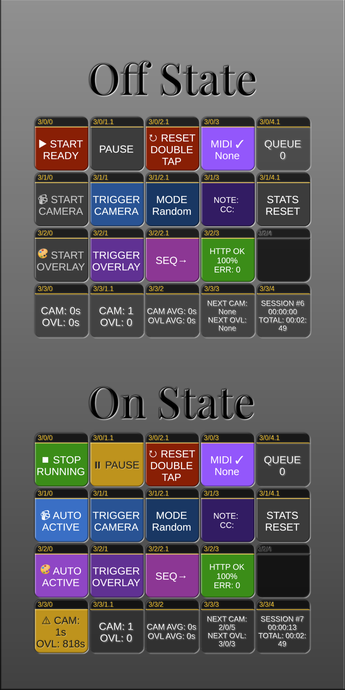

# companion-module-generic-showswitcher Ver 2.0.5

A [Bitfocus Companion](https://bitfocus.io/companion) module for professional broadcast automation with automatic camera and overlay switching, featuring advanced timing control, pause/resume functionality, sequential and random selection modes, performance monitoring, and comprehensive MIDI control.

## Why ShowSwitcher?

ShowSwitcher solves a simple problem: **solo performers can't manage production while performing**. Built for musicians, instructors, streamers, and content creators who need professional-looking camera switching but have their hands full. Set it once, and it automatically cycles through your cameras and overlays with randomized or sequential timing—making your stream look professionally produced while you focus on your performance.

## More Than Just Cameras

Since ShowSwitcher can trigger any Companion button, it's not limited to video switching. Use it to:

- **Automate lighting**: Cycle through DMX scenes, Philips Hue colors, or fog machines
- **Control audio**: Trigger sound effects, backing tracks, or mixer scenes
- **Engage viewers**: Launch polls, animations, or chat commands at random intervals
- **Run unattended streams**: Create 24/7 channels with dynamic content changes
- **Synchronize platforms**: Control OBS, vMix, ATEM, and streaming software simultaneously

Perfect for solo performers, escape rooms, theaters, educators, or anyone who needs hands-free production automation.



## 🎯 Version 2.0 Features

### New in Version 2.0

- **🎨 Optimized Button Layout**: 19 presets 
- **⏸️ Pause/Resume Functionality**: Pause and resume system operation without losing state
- **🔄 Sequential Mode**: Alternative to random selection - cycle through buttons in order
- **🚫 Button Blacklisting**: Temporarily exclude buttons from rotation
- **📊 Performance Monitoring**: Track HTTP success rates, response times, and errors
- **📈 Enhanced Statistics**: Average interval calculations and history tracking
- **🎹 Advanced MIDI Control**: Extended CC mappings for pause/resume (CC48/49)
- **⚡ Button Press Queue**: Prevent system overload with intelligent queueing
- **🔍 HTTP Error Tracking**: Monitor connection health and success rates
- **⏱️ Session Management**: Track total runtime, session counts, and pause durations

### Core Functionality

- **Dual Independent Switchers**: Separate control for camera angles and overlay graphics
- **Random Timing Engine**: Each switcher randomly selects intervals within configured ranges
- **System-Wide Control**: Start/stop both switchers simultaneously or control individually
- **Default Camera Return**: Automatically returns to the first camera button when system is stopped
- **Manual Override**: Instantly trigger any switcher while maintaining automatic operation
- **Dynamic Button Management**: Add or remove buttons from rotation during live operation
- **Comprehensive Status Tracking**: Monitor countdowns, trigger counts, and system duration

### Professional Features

- **Weighted Selection**: Include the same button multiple times for probability control
- **Zero-Downtime Reconfiguration**: Change settings without stopping the system
- **Persistent Counters**: Track total triggers across sessions
- **Flexible Timer Ranges**: Configure from 1 second to 2 hours per switcher
- **HTTP API Integration**: Works with Companion's built-in HTTP service
- **Full MIDI Control**: Direct MIDI input support with port selection and real-time control
- **Auto-Save Statistics**: Periodic saving of performance metrics

## 📋 Requirements

- **Bitfocus Companion**: Version 4.0.0 or later
- **Operating System**: Windows, macOS, or Linux
- **HTTP Service**: Must be enabled in Companion (Settings → HTTP)
- **Node.js**: Version 18.12 or later (included with Companion)

## 🚀 Installation Guide

### Manual Installation from GitHub

*(Sorry, this is the only way to do this, since BitFocus refuses to include ShowSwitcher in their modules package)*

#### For Windows Users

1. **Download and Extract the Module**
   - Open PowerShell or Command Prompt
   - Navigate to your Downloads folder:
     ```cmd
     cd %USERPROFILE%\Downloads
     ```
   - Clone the repository:
     ```cmd
     git clone https://github.com/bitfocus/companion-module-generic-showswitcher.git
     cd companion-module-generic-showswitcher
     ```

2. **Install Dependencies and Build**

   ```cmd
   npm install
   npm run build
   ```

3. **Install in Companion**
   - Open Companion (usually at http://localhost:8000)
   - Navigate to **Settings → Modules**
   - Click **Install Module from File**
   - Browse to `Downloads\companion-module-generic-showswitcher`
   - Select the `generic-showswitcher-2.0.5.tgz` file
   - Click **Install**
   - Restart Companion when prompted

#### For macOS Users

1. **Download and Extract the Module**
   - Open Terminal (Applications → Utilities → Terminal)
   - Navigate to your Downloads folder:
     ```bash
     cd ~/Downloads
     ```
   - Clone the repository:
     ```bash
     git clone https://github.com/bitfocus/companion-module-generic-showswitcher.git
     cd companion-module-generic-showswitcher
     ```

2. **Install Dependencies and Build**

   ```bash
   npm install
   npm run build
   ```

3. **Install in Companion**
   - Open Companion (usually at http://localhost:8000)
   - Navigate to **Settings → Modules**
   - Click **Install Module from File**
   - Browse to `~/Downloads/companion-module-generic-showswitcher`
   - Select the `generic-showswitcher-2.0.5.tgz` file
   - Click **Install**
   - Restart Companion when prompted

#### For Linux Users

1. **Download and Extract the Module**
   - Open Terminal
   - Navigate to your Downloads folder:
     ```bash
     cd ~/Downloads
     ```
   - Clone the repository:
     ```bash
     git clone https://github.com/bitfocus/companion-module-generic-showswitcher.git
     cd companion-module-generic-showswitcher
     ```

2. **Install Dependencies and Build**

   ```bash
   npm install
   npm run build
   ```

3. **Install in Companion**
   - Open Companion (usually at http://localhost:8000)
   - Navigate to **Settings → Modules**
   - Click **Install Module from File**
   - Browse to `~/Downloads/companion-module-generic-showswitcher`
   - Select the `generic-showswitcher-2.0.5.tgz` file
   - Click **Install**
   - Restart Companion when prompted

## ⚙️ Configuration

### Initial Setup

1. **Add the Connection**
   - Go to **Connections** tab in Companion
   - Click **Add connection**
   - Search for "Show Switcher" or find under **Generic → Show Switcher**
   - Click **Add**
   - Give it a name (e.g., "ShowSwitcher")
   - Configure the instance

2. **HTTP API Settings**
   | Setting | Default | Description |
   |---------|---------|-------------|
   | Companion Host | 127.0.0.1 | IP address of Companion (use 127.0.0.1 for local) |
   | Companion HTTP Port | 8000 | HTTP port from Companion settings |
   | Use Internal API | Unchecked | Experimental direct API access |
   | Enable Button Press Queue | Checked | Queue button presses to prevent overload |

3. **Camera Switcher Settings**
   | Setting | Default | Range | Description |
   |---------|---------|-------|-------------|
   | Minimum Seconds | 15 | 1-3600 | Shortest time between switches |
   | Maximum Seconds | 30 | 1-3600 | Longest time between switches |
   | Camera Buttons | 2/1/0, 2/1/1... | - | Comma-separated button locations |
   | Sequential Mode | Unchecked | - | Use sequential order instead of random |
   | Avoid Immediate Repeats | Checked | - | Prevent same button twice in a row |
   | History Size | 5 | 0-20 | Number of recent buttons to track |

4. **Overlay Switcher Settings**
   | Setting | Default | Range | Description |
   |---------|---------|-------|-------------|
   | Minimum Seconds | 600 | 1-7200 | Shortest time between overlays |
   | Maximum Seconds | 900 | 1-7200 | Longest time between overlays |
   | Overlay Buttons | 2/2/1, 3/0/3 | - | Comma-separated button locations |
   | Sequential Mode | Unchecked | - | Use sequential order instead of random |
   | Avoid Immediate Repeats | Checked | - | Prevent same button twice in a row |

5. **Statistics & Monitoring Settings**
   | Setting | Default | Description |
   |---------|---------|-------------|
   | Enable Statistics Tracking | Checked | Track and save usage statistics |
   | Enable Debug Logging | Unchecked | Verbose logging for troubleshooting |
   | Auto-Save Interval | 5 minutes | How often to save statistics |

6. **MIDI Control Settings**
   | Setting | Default | Description |
   |---------|---------|-------------|
   | Enable MIDI Control | Unchecked | Enable direct MIDI input |
   | Auto-Connect | Checked | Auto-connect to first MIDI device |
   | MIDI Input Port | None | Select from available devices |
   | MIDI Port Name | (empty) | Partial name match for auto-selection |

### Button Format

Buttons are specified in the format: `page/bank/button`

**Examples:**

- `2/1/0` - Page 2, Bank 1, Button 0
- `3/0/15` - Page 3, Bank 0, Button 15
- `99/99/99` - Page 99, Bank 99, Button 99

**Multiple buttons:** Separate with commas: `2/1/0, 2/1/1, 2/1/2`

**Weighted selection:** Repeat buttons for higher probability:

```
2/1/0, 2/1/0, 2/1/0, 2/1/1, 2/1/2
```

(Button 2/1/0 has 3x higher chance of selection)

## 🎮 Available Actions

### System Control

| Action            | Description                                      |
| ----------------- | ------------------------------------------------ |
| **System ON**     | Start both camera and overlay switchers          |
| **System OFF**    | Stop both switchers and return to default camera |
| **System Reset**  | Stop everything and reset all counters           |
| **System Toggle** | Toggle system between ON and OFF states          |
| **System Pause**  | Pause system operation (v2.0)                    |
| **System Resume** | Resume system operation (v2.0)                   |

### Camera Control

| Action                        | Description                             |
| ----------------------------- | --------------------------------------- |
| **Camera ON**                 | Start the camera switcher               |
| **Camera OFF**                | Stop the camera switcher                |
| **Camera Manual**             | Trigger camera immediately              |
| **Camera Toggle**             | Toggle camera switcher ON/OFF           |
| **Set Camera Timer**          | Set countdown to specific value         |
| **Set Camera Timer Range**    | Adjust min/max timing range             |
| **Set Camera Selection Mode** | Set to Random or Sequential mode        |
| **Camera Mode Toggle**        | Switch between sequential/random (v2.0) |
| **Camera Blacklist Button**   | Temporarily exclude a button (v2.0)     |
| **Camera Blacklist Clear**    | Clear all blacklisted buttons (v2.0)    |
| **Add Camera Button**         | Add button to rotation                  |
| **Remove Camera Button**      | Remove button from rotation             |
| **Reset Camera Counter**      | Reset trigger count to zero             |

### Overlay Control

| Action                         | Description                             |
| ------------------------------ | --------------------------------------- |
| **Overlay ON**                 | Start the overlay switcher              |
| **Overlay OFF**                | Stop the overlay switcher               |
| **Overlay Manual**             | Trigger overlay immediately             |
| **Overlay Toggle**             | Toggle overlay switcher ON/OFF          |
| **Set Overlay Timer**          | Set countdown to specific value         |
| **Set Overlay Timer Range**    | Adjust min/max timing range             |
| **Set Overlay Selection Mode** | Set to Random or Sequential mode        |
| **Overlay Mode Toggle**        | Switch between sequential/random (v2.0) |
| **Overlay Blacklist Button**   | Temporarily exclude a button (v2.0)     |
| **Overlay Blacklist Clear**    | Clear all blacklisted buttons (v2.0)    |
| **Add Overlay Button**         | Add button to rotation                  |
| **Remove Overlay Button**      | Remove button from rotation             |
| **Reset Overlay Counter**      | Reset trigger count to zero             |

### Performance & Statistics (v2.0)

| Action                   | Description                       |
| ------------------------ | --------------------------------- |
| **Clear Statistics**     | Reset performance statistics      |
| **Save Statistics**      | Manually save statistics to disk  |
| **Reset All Statistics** | Reset all statistics and counters |
| **Clear Button Queue**   | Clear button press queue          |

### MIDI Control

| Action                         | Description                     |
| ------------------------------ | ------------------------------- |
| **MIDI Connect**               | Connect to selected MIDI port   |
| **MIDI Disconnect**            | Disconnect from MIDI device     |
| **MIDI Toggle**                | Toggle MIDI connection on/off   |
| **MIDI Refresh Ports**         | Refresh available MIDI devices  |
| **MIDI Refresh**               | Refresh available MIDI devices  |
| **Camera Timer from MIDI CC**  | Set camera timer from CC value  |
| **Overlay Timer from MIDI CC** | Set overlay timer from CC value |

## 📊 Variables

All variables are available in the format: `$(showswitcher:variable_name)`

### System Variables

| Variable               | Description                   | Example                    |
| ---------------------- | ----------------------------- | -------------------------- |
| `system_status`        | Current system state          | Started / Stopped / Paused |
| `system_duration`      | Time since system started     | 01:23:45                   |
| `system_total_runtime` | Total runtime across sessions | 12:34:56                   |
| `system_session_count` | Number of start/stop cycles   | 42                         |

### Camera Variables

| Variable                  | Description                   | Example             |
| ------------------------- | ----------------------------- | ------------------- |
| `camera_status`           | Camera switcher state         | Running / Stopped   |
| `camera_countdown`        | Seconds until next switch     | 15                  |
| `camera_next_button`      | Next button to trigger        | 2/1/0               |
| `camera_previous_button`  | Last triggered button         | 2/1/3               |
| `camera_trigger_count`    | Total triggers this session   | 42                  |
| `camera_average_interval` | Average time between triggers | 22                  |
| `camera_mode`             | Current selection mode        | Sequential / Random |

### Overlay Variables

| Variable                   | Description                   | Example             |
| -------------------------- | ----------------------------- | ------------------- |
| `overlay_status`           | Overlay switcher state        | Running / Stopped   |
| `overlay_countdown`        | Seconds until next overlay    | 423                 |
| `overlay_next_button`      | Next button to trigger        | 3/0/3               |
| `overlay_previous_button`  | Last triggered button         | 2/2/1               |
| `overlay_trigger_count`    | Total triggers this session   | 5                   |
| `overlay_average_interval` | Average time between triggers | 650                 |
| `overlay_mode`             | Current selection mode        | Sequential / Random |

### Performance Variables (v2.0)

| Variable            | Description                         | Example |
| ------------------- | ----------------------------------- | ------- |
| `http_success_rate` | Percentage of successful HTTP calls | 98%     |
| `http_errors`       | Total HTTP errors                   | 3       |
| `queue_size`        | Current button press queue size     | 0       |

### MIDI Variables

| Variable         | Description              | Example            |
| ---------------- | ------------------------ | ------------------ |
| `midi_status`    | MIDI connection state    | Connected          |
| `midi_port`      | Connected MIDI device    | MPK mini Plus      |
| `midi_last_note` | Last received MIDI note  | Note 36 (vel: 127) |
| `midi_last_cc`   | Last received CC message | CC1: 64            |

## 🎨 Feedbacks

Visual feedbacks for button states and conditions.

### System Feedbacks

| Feedback                  | Description                           | Default Style     |
| ------------------------- | ------------------------------------- | ----------------- |
| **System Running**        | Active when system is running         | Green background  |
| **System Stopped**        | Active when system is stopped         | Red background    |
| **System Paused**         | Active when system is paused (v2.0)   | Yellow background |
| **System Duration Above** | Active when runtime exceeds threshold | Cyan background   |

### Camera Feedbacks

| Feedback                     | Description                            | Options         |
| ---------------------------- | -------------------------------------- | --------------- |
| **Camera Running**           | Active when camera switcher is running | -               |
| **Camera Stopped**           | Active when camera switcher is stopped | -               |
| **Camera Countdown Below**   | Active when countdown < threshold      | Threshold       |
| **Camera Next Button Match** | Active when specific button is next    | Button location |
| **Camera Count Above**       | Active when trigger count > threshold  | Count threshold |
| **Camera Sequential Mode**   | Active in sequential mode              | -               |
| **Camera Mode Random**       | Active in random mode (v2.0)           | -               |
| **Camera Mode Sequential**   | Active in sequential mode (v2.0)       | -               |

### Overlay Feedbacks

| Feedback                      | Description                             | Options         |
| ----------------------------- | --------------------------------------- | --------------- |
| **Overlay Running**           | Active when overlay switcher is running | -               |
| **Overlay Stopped**           | Active when overlay switcher is stopped | -               |
| **Overlay Countdown Below**   | Active when countdown < threshold       | Threshold       |
| **Overlay Next Button Match** | Active when specific button is next     | Button location |
| **Overlay Count Above**       | Active when trigger count > threshold   | Count threshold |
| **Overlay Sequential Mode**   | Active in sequential mode               | -               |
| **Overlay Mode Random**       | Active in random mode (v2.0)            | -               |
| **Overlay Mode Sequential**   | Active in sequential mode (v2.0)        | -               |

### Performance Feedbacks (v2.0)

| Feedback             | Description                  | Default Style     |
| -------------------- | ---------------------------- | ----------------- |
| **HTTP Errors High** | Active when error rate > 10% | Orange background |
| **Queue Full**       | Active when queue > 10 items | Red background    |
| **Statistics Saved** | Flash when statistics saved  | Green flash       |

### MIDI Feedbacks

| Feedback              | Description                   | Default Style     |
| --------------------- | ----------------------------- | ----------------- |
| **MIDI Connected**    | Active when MIDI connected    | Purple background |
| **MIDI Disconnected** | Active when MIDI disconnected | Gray background   |
| **MIDI Activity**     | Flash on MIDI activity        | Yellow flash      |

## 🎹 MIDI Control

### MIDI Note Assignments

#### System Control

| MIDI Note | Action        | Description             |
| --------- | ------------- | ----------------------- |
| 36 (C2)   | System ON     | Start both switchers    |
| 37 (C#2)  | System OFF    | Stop both switchers     |
| 38 (D2)   | System Reset  | Reset all counters      |
| 45 (A2)   | System Toggle | Toggle system on/off    |
| 48 (C3)   | System Pause  | Pause operation (v2.0)  |
| 49 (C#3)  | System Resume | Resume operation (v2.0) |

#### Camera Control

| MIDI Note | Action        | Description           |
| --------- | ------------- | --------------------- |
| 39 (D#2)  | Camera ON     | Start camera switcher |
| 40 (E2)   | Camera OFF    | Stop camera switcher  |
| 41 (F2)   | Camera Manual | Manual trigger        |
| 46 (A#2)  | Camera Toggle | Toggle on/off         |

#### Overlay Control

| MIDI Note | Action         | Description            |
| --------- | -------------- | ---------------------- |
| 42 (F#2)  | Overlay ON     | Start overlay switcher |
| 43 (G2)   | Overlay OFF    | Stop overlay switcher  |
| 44 (G#2)  | Overlay Manual | Manual trigger         |
| 47 (B2)   | Overlay Toggle | Toggle on/off          |

### MIDI Control Change (CC) Assignments

| CC Number | Function      | Description                         |
| --------- | ------------- | ----------------------------------- |
| CC1       | Camera Timer  | Maps 0-127 to camera min-max range  |
| CC2       | Overlay Timer | Maps 0-127 to overlay min-max range |
| CC48      | System Pause  | Values > 64 pause system (v2.0)     |
| CC49      | System Resume | Values > 64 resume system (v2.0)    |

## 📚 Presets

### Version 2.0 Preset Improvements

The module now includes **19 optimized presets** (reduced from 29) organized into 5 logical categories with consistent color coding and smart consolidation:

### 🎨 Color Coding System

- **🟢 GREEN**: Active/Running/Go states
- **🔴 RED**: Stopped/Inactive/Critical alerts
- **🟡 YELLOW**: Warning/Paused/Attention needed
- **🔵 BLUE**: Camera-related operations
- **🟣 PURPLE**: Overlay-related operations
- **⚫ GRAY**: Inactive/Disabled states

### Preset Categories (Priority Order)

#### 1️⃣ Master Control (3 presets)

- **System Start/Stop** - Combined toggle with STATS ready indicator via color
- **Pause/Resume** - Smart state-aware toggle
- **System Reset** - Double-tap safety feature

#### 2️⃣ Camera Operations (3 presets)

- **Camera Auto/Manual** - Start/stop automatic switching
- **Manual Camera Trigger** - Force immediate switch
- **Camera Mode** - Toggle Sequential/Random

#### 3️⃣ Overlay Operations (3 presets)

- **Overlay Auto/Manual** - Start/stop overlay switching
- **Manual Overlay Trigger** - Force immediate switch
- **Overlay Mode** - Toggle Sequential/Random

#### 4️⃣ Live Monitoring (5 combined displays)

- **Combined Countdown** - CAM & OVL timers with smart warnings
- **Combined Counters** - Both counts with double-tap reset
- **Combined Averages** - CAM & OVL average intervals
- **Next Preview** - Shows next CAM & OVL buttons
- **Session Info** - Session #, duration, and total runtime

#### 5️⃣ MIDI & Performance (5 presets)

- **MIDI Status** - Connect/disconnect with visual feedback
- **MIDI Monitor** - Shows last Note & CC received
- **HTTP Performance** - Success rate with error warnings
- **Queue Management** - Queue size with double-tap clear
- **Statistics Reset** - Double-tap to reset all stats

## 🎨 Enhanced Preset Design

The module's 19 optimized presets use Companion's multi-step functionality and maintains all functionality.

### Button Design Philosophy

- **Combined displays** - Related information merged into single buttons
- **Consistent color scheme** - Visual feedback through standardized colors
- **Smart text sizing** - 18pt for actions, 14pt for two-line, 11pt for details
- **Symbol-based status** - Using ✓, ✗, ⟳ instead of verbose text
- **Double-tap safety** - All destructive actions require confirmation
- **Priority ordering** - Most important controls placed first

### System Control Buttons

#### System Start/Stop (Single Button)

- **First Press**: Starts the system (both camera and overlay switchers)
- **Second Press**: Stops the system and returns to default camera
- **Visual States**:
  - Red with ⏵ icon when stopped
  - Green with ⏹ icon when running
  - Yellow with ⏸ icon when paused

#### System Pause/Resume (Smart Toggle)

- **Function**: Intelligently pauses or resumes based on current state
- **Step 1**: Pauses the system if running
- **Step 2**: Resumes the system if paused
- **Visual Feedback**: Changes from ⏸ PAUSE to ▶ RESUME

#### System Reset (Double-Tap Safety)

- **Step 1**: First press arms the reset (no action)
- **Step 2**: Second press executes the reset
- **Safety Feature**: Prevents accidental resets during live production

### Camera Control Buttons

#### Camera Control (Single Toggle)

- **Function**: Start/Stop camera switcher with one button
- **Visual States**:
  - Gray "📹 START" when stopped
  - Blue "📹 ACTIVE" when running
- **Icon**: Camera emoji provides instant recognition

#### Camera Mode (Cycle Button)

- **Step 1**: Switch to Sequential mode
- **Step 2**: Switch back to Random mode
- **Display**: Shows current mode with appropriate icon (🔀 for random, ➡ for sequential)

#### Camera Manual Trigger

- **Function**: Instantly triggers next camera switch
- **Icon**: 🎬 (clapperboard) indicates manual action
- **Use Case**: Override automatic timing when needed

### Overlay Control Buttons

#### Overlay Control (Single Toggle)

- **Function**: Start/Stop overlay switcher with one button
- **Visual States**:
  - Dark purple "🎨 START" when stopped
  - Bright purple "🎨 ACTIVE" when running

#### Overlay Mode (Cycle Button)

- **Function**: Toggles between Sequential and Random modes
- **Visual Feedback**: Color and icon change based on mode

#### Overlay Manual Trigger

- **Function**: Instantly triggers next overlay
- **Icon**: ✨ (sparkles) for graphics/overlay association

### Status Display Buttons

#### Countdown Displays

- **Camera Countdown**: Shows "📹 CAM" with seconds remaining
- **Overlay Countdown**: Shows "🎨 OVL" with seconds remaining
- **Warning State**: Turns yellow with ⚠ icon when time is low
- **Stopped State**: Shows "OFF" in gray when not running

#### Counter Buttons (with Reset)

- **Single Tap**: Displays current count
- **Double Tap**: Resets counter to zero
- **Visual Feedback**: Changes color when count exceeds threshold
- **Safety**: Requires intentional double-tap to reset

#### Duration Displays

- **Active Duration**: Shows current session time with ⏱ icon
- **Total Runtime**: Shows cumulative time with ∑ symbol
- **Session Count**: Shows number of start/stop cycles with # symbol

### Performance Monitoring Buttons

#### HTTP Success Rate

- **Normal**: Green "📊 SUCCESS" with percentage
- **Error State**: Orange "⚠ ERROR" when error rate > 10%
- **Real-time Updates**: Shows current success percentage

#### Queue Size (with Clear)

- **Display**: Shows current queue size with 📋 icon
- **Single Tap**: View queue size
- **Double Tap**: Clear the queue
- **Warning**: Red "⚠ QUEUE FULL" when overloaded

#### Statistics Control

- **Step 1**: View statistics status
- **Step 2**: Reset all statistics (requires double-tap)
- **Icon**: 💾 indicates save/storage functions

### MIDI Control Buttons

#### MIDI Connection (Smart Toggle)

- **Step 1**: Connect to first available MIDI device
- **Step 2**: Disconnect from current device
- **Visual States**:
  - Gray "🎹 CONNECT" when disconnected
  - Purple "🎹 ✓ CONNECTED" when active

#### MIDI Port Display

- **Function**: Shows connected device name
- **Press Action**: Refreshes available MIDI ports
- **Visual**: Flashes yellow on MIDI activity

#### MIDI Activity Monitors

- **Last Note**: Shows most recent MIDI note with ♪ icon
- **Last CC**: Shows most recent control change with 🎛 icon
- **Use**: Helpful for debugging MIDI mappings

### Button Usage Tips

1. **Color Coding**:
   - Green = Active/Running
   - Red = Stopped/Error
   - Yellow = Warning/Paused
   - Blue = Camera-related
   - Purple = Overlay/MIDI-related
   - Gray = Inactive/Disabled

2. **Double-Tap Functions**:
   - Always used for destructive actions (reset, clear)
   - Prevents accidental triggers during live shows
   - Visual feedback confirms action readiness

3. **Icon Reference**:
   - ⏵ Play / ⏹ Stop / ⏸ Pause / ▶ Resume
   - 📹 Camera / 🎨 Overlay / 🎬 Trigger
   - ⚙ Settings / ↻ Reset / 🔀 Random / ➡ Sequential
   - ⏱ Timer / 📊 Stats / 💾 Save / 📋 Queue
   - 🎹 MIDI / 🎛 Control / ♪ Note
   - ⚠ Warning / ❌ Error / ✓ Success

4. **Optimal Layout**:
   - Place System controls in top row
   - Camera controls on left side
   - Overlay controls on right side
   - Status displays in center
   - Performance monitors at bottom

5. **Stream Deck Pages**:
   - Page 1: Main controls (System, Camera, Overlay)
   - Page 2: Status displays and counters
   - Page 3: Performance and MIDI controls

## 🔧 Troubleshooting

### Module Not Appearing in Companion

1. **Verify Installation**
   - Check that the module folder exists in the correct location
   - Ensure all dependencies were installed (`npm install`)
   - Restart Companion completely

2. **Check Companion Version**
   - Ensure you have Companion 3.0.0 or later
   - Update Companion if necessary

3. **Clear Module Cache**
   - Go to Settings → Modules → Clear Cache
   - Restart Companion

### Connection Issues

1. **HTTP Service Not Available**
   - Enable HTTP service in Companion Settings → HTTP
   - Verify port number matches configuration (default: 8000)
   - Check firewall settings

2. **Buttons Not Triggering**
   - Verify button locations exist (page/bank/button format)
   - Check Companion log for errors
   - Ensure buttons are properly configured in Companion

### Performance Issues

1. **High HTTP Error Rate**
   - Check network connectivity
   - Verify Companion HTTP service is running
   - Enable button press queue if not already enabled

2. **Queue Building Up**
   - Reduce trigger frequency (increase min/max times)
   - Check for circular button references
   - Monitor system resources

### MIDI Issues

1. **Device Not Detected**
   - Connect MIDI device before starting Companion
   - Use "MIDI Refresh Ports" action
   - Check device drivers are installed

2. **MIDI Not Responding**
   - Verify `midi_status` shows "Connected"
   - Enable debug logging to see MIDI messages
   - Check MIDI device is sending on any channel

## 💡 Tips and Best Practices

1. **Start with Testing**: Use high page numbers (99/99/0) for testing before production
2. **Default Camera**: Place your main camera first in the list for automatic return
3. **Use Presets**: Start with included presets and customize
4. **Monitor Performance**: Watch HTTP success rate and queue size
5. **Sequential for Shows**: Use sequential mode for scripted productions
6. **Random for Natural**: Use random mode for natural-looking switching
7. **Backup Settings**: Export Companion configuration regularly
8. **Test Pause/Resume**: Practice pause/resume during rehearsals
9. **Use Blacklisting**: Temporarily exclude problematic cameras
10. **Monitor Statistics**: Check average intervals to optimize timing

## 📝 Version History

### Version 2.0.5 (Current and Final Release)

- **CRITICAL FIX**: Resolved MIDI port detection issue on remote machines
- Fixed jzz library bundling and import mechanism
- MIDI functionality now works consistently across all installations

## 🤝 Support

### Getting Help

- **Documentation**: Check this README and the module's HELP.md file

### Known Limitations

- Requires Companion's HTTP service to be enabled
- Button triggers are one-way (no feedback from triggered actions)
- Statistics persistence requires file system access
- MIDI device must be connected before module initialization for dropdown

## 📄 License

MIT License - See [LICENSE](LICENSE) file for details

## 👏 Credits

- **Author**: Larry Seyer (bitfocus@larryseyer.com)
- **Website**: [LarrySeyer.com](http://LarrySeyer.com)
- **Repository**: [GitHub](https://github.com/bitfocus/companion-module-generic-showswitcher)
- **Framework**: [Bitfocus Companion Module Base](https://github.com/bitfocus/companion-module-base)

---

_For the latest updates and information, visit the [GitHub repository](https://github.com/bitfocus/companion-module-generic-showswitcher)_
