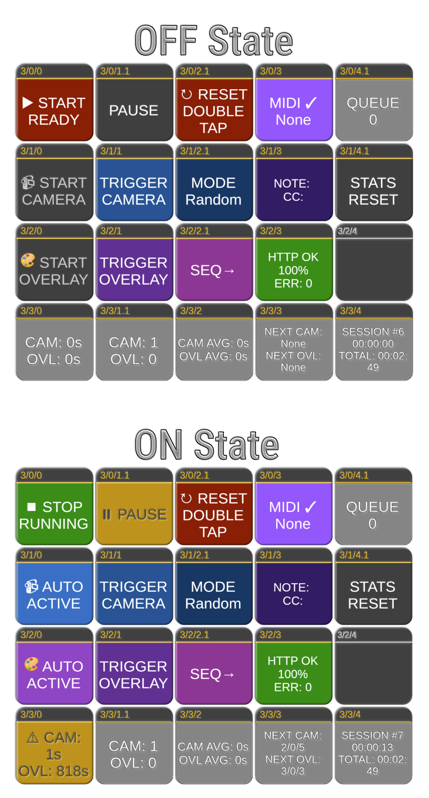

# companion-module-generic-showswitcher

A [Bitfocus Companion](https://bitfocus.io/companion) module for automatic camera and overlay switching with random timing control. This module provides professional broadcast automation capabilities, allowing you to automatically switch between camera angles and trigger overlay graphics at randomized intervals.



## Features

### Core Functionality

- **Dual Independent Switchers**: Separate control for camera angles and overlay graphics
- **Random Timing Engine**: Each switcher randomly selects intervals within configured ranges
- **System-Wide Control**: Start/stop both switchers simultaneously or control individually
- **Manual Override**: Instantly trigger any switcher while maintaining automatic operation
- **Dynamic Button Management**: Add or remove buttons from rotation during live operation
- **Comprehensive Status Tracking**: Monitor countdowns, trigger counts, and system duration

### Professional Features

- **Weighted Selection**: Include the same button multiple times for probability control
- **Zero-Downtime Reconfiguration**: Change settings without stopping the system
- **Persistent Counters**: Track total triggers across sessions
- **Flexible Timer Ranges**: Configure from 1 second to 2 hours per switcher
- **HTTP API Integration**: Works with Companion's built-in HTTP service
- **Full MIDI Control**: Direct MIDI input support with port selection and real-time control

## Requirements

- **Bitfocus Companion**: Version 3.0.0 or later
- **Operating System**: Windows, macOS, or Linux
- **HTTP Service**: Must be enabled in Companion (Settings → HTTP)
- **Node.js**: Version 18.12 or later (included with Companion)

## Installation

### Method 1: Manual Installation (Immediate Use)

1. **Download the Module**

   ```bash
   # Clone the repository
   git clone https://github.com/bitfocus/companion-module-generic-showswitcher.git
   cd companion-module-generic-showswitcher

   # Install dependencies
   npm install

   # Build the module
   npx companion-module-build
   ```

2. **Install in Companion**
   - Open Companion web interface (typically http://localhost:8000)
   - Navigate to **Settings → Modules**
   - Click **Install Module from File**
   - Select the generated `generic-showswitcher-*.tgz` file
   - Restart Companion if prompted

3. **Alternative: Development Mode**
   - Copy the module folder to Companion's `bundled-modules` directory:
     - Windows: `%APPDATA%\companion\bundled-modules\`
     - macOS: `~/Library/Application Support/companion/bundled-modules/`
     - Linux: `~/.config/companion/bundled-modules/`
   - Restart Companion

### Method 2: From Companion Module Store (When Available)

1. Open Companion web interface
2. Go to **Connections**
3. Click **Add connection**
4. Search for "Show Switcher" or browse under "Generic"
5. Click **Add** to install

## Configuration

### Initial Setup

1. **Add the Connection**
   - Go to **Connections** tab
   - Click **Add connection**
   - Select **Generic → Show Switcher**
   - Configure the instance

2. **HTTP API Settings**
   | Setting | Default | Description |
   |---------|---------|-------------|
   | Companion Host | 127.0.0.1 | IP address of Companion (use 127.0.0.1 for local) |
   | Companion HTTP Port | 8000 | HTTP port from Companion settings |
   | Use Internal API | Unchecked | Experimental direct API access |

3. **Camera Switcher Settings**
   | Setting | Default | Range | Description |
   |---------|---------|-------|-------------|
   | Minimum Seconds | 15 | 1-3600 | Shortest time between switches |
   | Maximum Seconds | 30 | 1-3600 | Longest time between switches |
   | Camera Buttons | 2/1/0, 2/1/1... | - | Comma-separated button locations |

4. **Overlay Switcher Settings**
   | Setting | Default | Range | Description |
   |---------|---------|-------|-------------|
   | Minimum Seconds | 600 | 1-7200 | Shortest time between overlays |
   | Maximum Seconds | 900 | 1-7200 | Longest time between overlays |
   | Overlay Buttons | 2/2/1, 3/0/3 | - | Comma-separated button locations |

5. **MIDI Control Settings**
   | Setting | Default | Description |
   |---------|---------|-------------|
   | Enable MIDI Control | Unchecked | Enable direct MIDI input for controlling the switcher |
   | Auto-Connect | Checked | Automatically connect to the first available MIDI device |
   | MIDI Input Port | None | Select from dropdown of available MIDI devices |
   | MIDI Port Name | (empty) | Optional partial name match for automatic port selection |

### Button Format

Buttons are specified in the format: `page/bank/button`

**Examples:**

- `2/1/0` - Page 2, Bank 1, Button 0
- `3/0/15` - Page 3, Bank 0, Button 15
- `99/99/99` - Page 99, Bank 99, Button 99

**Multiple buttons:** Separate with commas: `2/1/0, 2/1/1, 2/1/2`

**Weighted selection:** Repeat buttons for higher probability:

```
2/1/0, 2/1/0, 2/1/0, 2/1/1, 2/1/2
```

(Button 2/1/0 has 3x higher chance of selection)

## Available Actions

### System Control

| Action            | Description                                    |
| ----------------- | ---------------------------------------------- |
| **System ON**     | Start both camera and overlay switchers        |
| **System OFF**    | Stop both switchers                            |
| **System Reset**  | Stop everything and reset all counters to zero |
| **System Toggle** | Toggle system between ON and OFF states        |

### Camera Control

| Action                     | Description                                         |
| -------------------------- | --------------------------------------------------- |
| **Camera ON**              | Start the camera switcher                           |
| **Camera OFF**             | Stop the camera switcher                            |
| **Camera Manual**          | Trigger camera immediately (auto-starts if stopped) |
| **Camera Toggle**          | Toggle camera switcher ON/OFF                       |
| **Set Camera Timer**       | Set countdown to specific value (seconds)           |
| **Set Camera Timer Range** | Adjust min/max timing range dynamically             |
| **Add Camera Button**      | Add a button to the rotation list                   |
| **Remove Camera Button**   | Remove a button from the rotation list              |
| **Reset Camera Counter**   | Reset trigger count to zero                         |

### Overlay Control

| Action                      | Description                                          |
| --------------------------- | ---------------------------------------------------- |
| **Overlay ON**              | Start the overlay switcher                           |
| **Overlay OFF**             | Stop the overlay switcher                            |
| **Overlay Manual**          | Trigger overlay immediately (auto-starts if stopped) |
| **Overlay Toggle**          | Toggle overlay switcher ON/OFF                       |
| **Set Overlay Timer**       | Set countdown to specific value (seconds)            |
| **Set Overlay Timer Range** | Adjust min/max timing range dynamically              |
| **Add Overlay Button**      | Add a button to the rotation list                    |
| **Remove Overlay Button**   | Remove a button from the rotation list               |
| **Reset Overlay Counter**   | Reset trigger count to zero                          |

### MIDI Control

| Action                            | Description                                            |
| --------------------------------- | ------------------------------------------------------ |
| **MIDI Connect**                  | Manually connect to a specific MIDI port from dropdown |
| **MIDI Disconnect**               | Disconnect from current MIDI device                    |
| **MIDI Refresh Ports**            | Refresh the list of available MIDI devices             |
| **Camera Timer from MIDI CC**     | Set camera timer from MIDI CC value (0-127)            |
| **Overlay Timer from MIDI CC**    | Set overlay timer from MIDI CC value (0-127)           |
| **Show MIDI Configuration Guide** | Display MIDI setup instructions in the log             |

## Variables

All variables are available in the format: `$(showswitcher:variable_name)`

### System Variables

| Variable          | Description               | Example Value     |
| ----------------- | ------------------------- | ----------------- |
| `system_status`   | Current system state      | Started / Stopped |
| `system_duration` | Time since system started | 01:23:45          |

### Camera Variables

| Variable                 | Description                 | Example Value     |
| ------------------------ | --------------------------- | ----------------- |
| `camera_status`          | Camera switcher state       | Running / Stopped |
| `camera_countdown`       | Seconds until next switch   | 15                |
| `camera_next_button`     | Next button to trigger      | 2/1/0             |
| `camera_previous_button` | Last triggered button       | 2/1/3             |
| `camera_trigger_count`   | Total triggers this session | 42                |

### Overlay Variables

| Variable                  | Description                 | Example Value     |
| ------------------------- | --------------------------- | ----------------- |
| `overlay_status`          | Overlay switcher state      | Running / Stopped |
| `overlay_countdown`       | Seconds until next overlay  | 423               |
| `overlay_next_button`     | Next button to trigger      | 3/0/3             |
| `overlay_previous_button` | Last triggered button       | 2/2/1             |
| `overlay_trigger_count`   | Total triggers this session | 5                 |

### MIDI Variables

| Variable         | Description                | Example Value            |
| ---------------- | -------------------------- | ------------------------ |
| `midi_status`    | MIDI connection state      | Connected / Disconnected |
| `midi_port`      | Connected MIDI device name | MPK mini Plus            |
| `midi_last_note` | Last received MIDI note    | Note 36 (vel: 127)       |
| `midi_last_cc`   | Last received CC message   | CC1: 64                  |

## Feedbacks

Visual feedbacks for button states and conditions.

### System Feedbacks

| Feedback                  | Description                           | Default Style    |
| ------------------------- | ------------------------------------- | ---------------- |
| **System Running**        | Active when system is running         | Green background |
| **System Stopped**        | Active when system is stopped         | Red background   |
| **System Duration Above** | Active when runtime exceeds threshold | Cyan background  |

### Camera Feedbacks

| Feedback                     | Description                            | Options             |
| ---------------------------- | -------------------------------------- | ------------------- |
| **Camera Running**           | Active when camera switcher is running | -                   |
| **Camera Stopped**           | Active when camera switcher is stopped | -                   |
| **Camera Countdown Below**   | Active when countdown < threshold      | Threshold (seconds) |
| **Camera Next Button Match** | Active when specific button is next    | Button location     |
| **Camera Count Above**       | Active when trigger count > threshold  | Count threshold     |

### Overlay Feedbacks

| Feedback                      | Description                             | Options             |
| ----------------------------- | --------------------------------------- | ------------------- |
| **Overlay Running**           | Active when overlay switcher is running | -                   |
| **Overlay Stopped**           | Active when overlay switcher is stopped | -                   |
| **Overlay Countdown Below**   | Active when countdown < threshold       | Threshold (seconds) |
| **Overlay Next Button Match** | Active when specific button is next     | Button location     |
| **Overlay Count Above**       | Active when trigger count > threshold   | Count threshold     |

### MIDI Feedbacks

| Feedback              | Description                             | Default Style     |
| --------------------- | --------------------------------------- | ----------------- |
| **MIDI Connected**    | Active when MIDI device is connected    | Purple background |
| **MIDI Disconnected** | Active when MIDI device is disconnected | Gray background   |
| **MIDI Activity**     | Flash indicator for MIDI activity       | Yellow background |

## Presets

The module includes 19 ready-to-use presets organized in categories:

### System Control (4 presets)

- **System ON** - Green button with running feedback
- **System OFF** - Red button with stopped feedback
- **System Reset** - Yellow reset button
- **System Toggle** - Dynamic ON/OFF toggle with text change

### Camera Control (4 presets)

- **Camera ON** - Start camera switcher
- **Camera OFF** - Stop camera switcher
- **Camera Manual** - Manual trigger button
- **Camera Toggle** - Dynamic toggle with state feedback

### Overlay Control (4 presets)

- **Overlay ON** - Start overlay switcher
- **Overlay OFF** - Stop overlay switcher
- **Overlay Manual** - Manual trigger button
- **Overlay Toggle** - Dynamic toggle with state feedback

### Status Display (7 presets)

- **Camera Countdown** - Live countdown with warning colors
- **Overlay Countdown** - Live countdown with warning colors
- **System Duration** - Active time display
- **Camera Next Button** - Shows next camera to trigger
- **Overlay Next Button** - Shows next overlay to trigger
- **Camera Trigger Count** - Total camera switches
- **Overlay Trigger Count** - Total overlay triggers

## MIDI Control

### Overview

Version 1.0.1 adds comprehensive MIDI control capabilities, allowing you to control all switcher functions using any MIDI controller. The module receives MIDI input directly and maps notes and Control Change (CC) messages to actions.

### MIDI Setup

#### Quick Start

1. **Enable MIDI** in the module configuration
2. **Select your MIDI device** from the dropdown (auto-populated with available devices)
3. **Save configuration** to activate MIDI input
4. Start sending MIDI notes/CC from your controller

#### Port Selection Methods

- **Dropdown Selection**: Choose your device from the populated list
- **Auto-Connect**: Enable to automatically connect to the first available MIDI device
- **Name Matching**: Enter partial device name (e.g., "MPK", "APC40", "Launch")
- **Manual Connection**: Use the MIDI Connect action to switch devices on-the-fly

### MIDI Note Assignments

The following MIDI notes (0-127 range) trigger specific actions:

#### System Control

| MIDI Note | Action        | Description                             |
| --------- | ------------- | --------------------------------------- |
| 36 (C2)   | System ON     | Start both camera and overlay switchers |
| 37 (C#2)  | System OFF    | Stop both switchers                     |
| 38 (D2)   | System Reset  | Reset all counters and stop switchers   |
| 45 (A2)   | System Toggle | Toggle system on/off                    |

#### Camera Control

| MIDI Note | Action        | Description                   |
| --------- | ------------- | ----------------------------- |
| 39 (D#2)  | Camera ON     | Start camera switcher         |
| 40 (E2)   | Camera OFF    | Stop camera switcher          |
| 41 (F2)   | Camera Manual | Manually trigger next camera  |
| 46 (A#2)  | Camera Toggle | Toggle camera switcher on/off |

#### Overlay Control

| MIDI Note | Action         | Description                    |
| --------- | -------------- | ------------------------------ |
| 42 (F#2)  | Overlay ON     | Start overlay switcher         |
| 43 (G2)   | Overlay OFF    | Stop overlay switcher          |
| 44 (G#2)  | Overlay Manual | Manually trigger next overlay  |
| 47 (B2)   | Overlay Toggle | Toggle overlay switcher on/off |

### MIDI Control Change (CC) Assignments

Use MIDI CC messages for real-time timer control:

| CC Number | Function      | Description                                 |
| --------- | ------------- | ------------------------------------------- |
| CC1       | Camera Timer  | Maps 0-127 to camera min-max seconds range  |
| CC2       | Overlay Timer | Maps 0-127 to overlay min-max seconds range |

#### CC Value Mapping

- **CC Value 0**: Sets timer to minimum configured seconds
- **CC Value 127**: Sets timer to maximum configured seconds
- **CC Values 1-126**: Linear interpolation between min and max

**Example**: If camera min=15s and max=30s:

- CC1 value 0 → 15 seconds
- CC1 value 64 → ~22 seconds
- CC1 value 127 → 30 seconds

### MIDI Controller Examples

#### Akai MPK Mini

```
Pads: Use for note triggers (36-47)
Knobs: Assign K1 to CC1 (camera), K2 to CC2 (overlay)
```

#### Novation Launchpad

```
Grid buttons: Map to notes 36-47 for system control
Scene buttons: Additional manual triggers
```

#### Generic MIDI Keyboard

```
Keys C2-B2: System and switcher controls
Mod wheel: Assign to CC1 for camera timing
Pitch bend: Could be mapped to CC2 for overlay timing
```

### Advanced MIDI Features

#### Dynamic Timer Control

Use CC messages to adjust timers in real-time while switchers are running. The countdown will immediately update to the new value.

#### MIDI Learn Workflow

1. Use "Show MIDI Configuration Guide" action to display mappings
2. Monitor `midi_last_note` and `midi_last_cc` variables
3. Press buttons/move controls on your MIDI device
4. Note which MIDI messages are sent
5. Configure your controller accordingly

#### Multiple Device Support

- Switch between MIDI devices using the "MIDI Connect" action
- Useful for using different controllers for different show segments

### Troubleshooting MIDI

#### MIDI Device Not Appearing

1. Connect MIDI device before starting Companion
2. Use "MIDI Refresh Ports" action to rescan
3. Save and re-open configuration to refresh dropdown

#### MIDI Not Responding

1. Check `midi_status` variable shows "Connected"
2. Enable debug logging to see MIDI messages
3. Verify MIDI device is sending on any channel (omni mode)
4. Check `midi_last_note` variable to confirm reception

#### Port Selection Issues

- Dropdown shows devices after saving and reopening config
- Use partial name match if dropdown isn't updating
- Port indices start at 0 (first device)

## Use Cases

### Live Production

Configure camera buttons for your switching system:

```
Camera Buttons: 1/0/0, 1/0/1, 1/0/2, 1/0/3
Min: 10 seconds, Max: 25 seconds
```

### Streaming with Overlays

Set up periodic sponsor graphics:

```
Overlay Buttons: 2/0/0, 2/0/1, 2/0/2
Min: 300 seconds (5 min), Max: 600 seconds (10 min)
```

### Weighted Random Selection

Give certain cameras more screen time:

```
Camera Buttons: 1/0/0, 1/0/0, 1/0/0, 1/0/1, 1/0/2
(Camera 1/0/0 appears 3x more often)
```

### Conference Recording

Long intervals for speaker podium switches:

```
Camera Buttons: 1/0/0, 1/0/1
Min: 60 seconds, Max: 180 seconds
```

## Troubleshooting

### Module Shows "Connection Failure"

1. Check Companion's HTTP service is enabled (Settings → HTTP)
2. Verify the HTTP port matches your configuration
3. Ensure Companion Host is correct (127.0.0.1 for local)

### Buttons Not Triggering

1. Verify button locations exist in your Companion setup
2. Check the format: `page/bank/button` (e.g., `2/1/0`)
3. Ensure at least one button is in the list
4. Check Companion's log for error messages

### Countdown Stuck at 0

1. Verify minimum time < maximum time
2. Check that buttons are configured
3. Ensure the switcher is actually running (not just system ON)

### System Stops Unexpectedly

1. Check for HTTP connection errors in the log
2. Verify Companion HTTP service hasn't been disabled
3. Ensure no circular button references

### Variables Not Updating

1. Check the instance name matches in variable references
2. Use format: `$(showswitcher:variable_name)`
3. Ensure the module instance is enabled

## Tips and Best Practices

1. **Start Simple**: Test with high page numbers (99/99/0) before using production buttons
2. **Use Presets**: Start with presets and customize as needed
3. **Monitor Logs**: Enable debug logging during setup
4. **Backup Configuration**: Export your Companion config before major changes
5. **Test Manual Triggers**: Verify manual triggers work before relying on automation
6. **Use Variables**: Display countdowns on Stream Deck buttons for operator awareness
7. **Weighted Selection**: Duplicate important cameras in the list for more frequent display

## Support

### Getting Help

- **GitHub Issues**: [Report bugs or request features](https://github.com/bitfocus/companion-module-generic-showswitcher/issues)
- **Companion Slack**: Join the [Bitfocus Slack](https://bitfocus.io/slack) community
- **Documentation**: Check the module's HELP.md file in Companion

### Known Limitations

- Requires Companion's HTTP service to be enabled
- Button triggers are one-way (no feedback from triggered actions)
- MIDI device must be connected before module initialization for dropdown population

## License

MIT License - See [LICENSE](LICENSE) file for details

## Credits

- **Author**: Larry Seyer
- **Contributors**: [List of contributors](https://github.com/bitfocus/companion-module-generic-showswitcher/contributors)
- **Based on**: Show Switcher standalone web application
- **Framework**: [Bitfocus Companion Module Base](https://github.com/bitfocus/companion-module-base)

## Version History

### 1.0.1 (2025-08-30)

- Added comprehensive MIDI control support
- Direct MIDI input with automatic port detection
- MIDI note mappings for all system functions (notes 36-47)
- MIDI CC support for real-time timer control (CC1, CC2)
- Dynamic MIDI port selection with device name display
- MIDI status variables and feedbacks
- MIDI learn workflow support
- Multiple MIDI device switching capability

### 1.0.0 (2025-08-30)

- Initial release
- Full feature parity with Show Switcher web application
- Support for dual independent switchers
- Comprehensive actions, feedbacks, and variables
- 19 ready-to-use presets
- HTTP API integration with configurable host/port

---

_For the latest updates and information, visit the [GitHub repository](https://github.com/bitfocus/companion-module-generic-showswitcher)_


